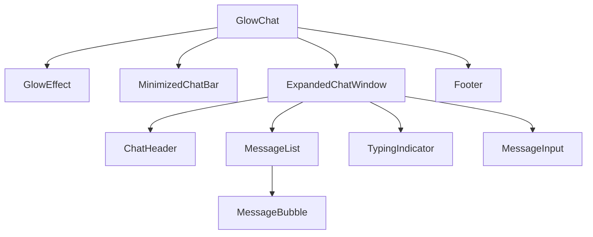

# Component Architecture and Message System

This document describes the component hierarchy and message flow in GlowChat.

## Component Hierarchy

- **GlowChat**: Root wrapper managing expand/minimize, audio, animation.
- **GlowEffect**: Renders rotating conic gradient glow.
- **MinimizedChatBar**: Capsule bar state.
- **ExpandedChatWindow**: Full window state containing subcomponents.

## Message System Logic

### useChat Hook (`frontend/src/hooks/useChat.ts`)

- **State**:
  - `messages: Message[]` (max 50 FIFO)
  - `input: string`
  - `isTyping: boolean`

- **sendMessage()**:
  1. Trim input, prevent empty or concurrent typing.
  2. Log and add user message.
  3. Set `isTyping=true`.
  4. Await `getAIResponse(userInput)` (2s delay).
  5. Add AI message and set `isTyping=false`.

### chatService (`frontend/src/lib/chatService.ts`)

- **Responses**: Maps keywords to Arabic replies.
- **getAIResponse()**: Returns `Promise<string>` after a `setTimeout(...,2000)`.

## Message Flow

1. User types and sends message in `MessageInput`.
2. `useChat` updates `messages` and displays in `MessageList`.
3. `TypingIndicator` appears while awaiting AI response.
4. AI response is appended to `messages` and `TypingIndicator` hides.
