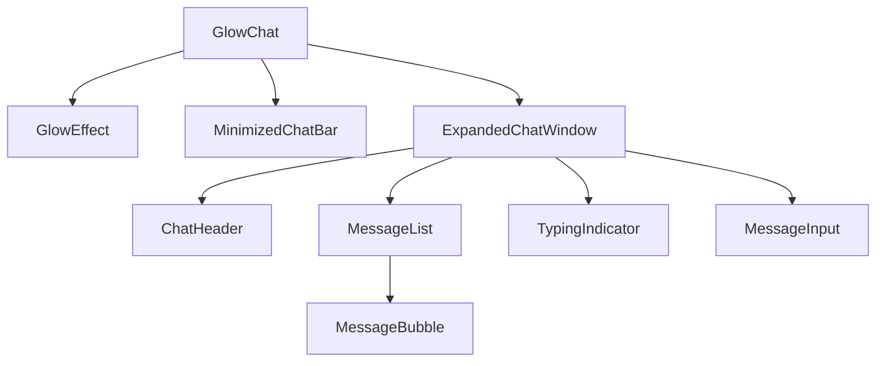

# Developer Implementation Guide for GlowChat

This comprehensive guide consolidates all steps, code snippets, and best practices needed to recreate, configure, and customize the GlowChat Arabic chat interface from scratch.

---

## Table of Contents
1. [Prerequisites & Setup](#prerequisites--setup)
2. [Project Initialization](#project-initialization)
3. [Framework & Dependency Configuration](#framework--dependency-configuration)
4. [Global Styles & RTL Support](#global-styles--rtl-support)
5. [Component Architecture Overview](#component-architecture-overview)
6. [Animated Glow Effect Implementation](#animated-glow-effect-implementation)
7. [State Transitions with Framer Motion](#state-transitions-with-framer-motion)
8. [Message System & Input Handling](#message-system--input-handling)
9. [Typing Indicator Animation](#typing-indicator-animation)
10. [Responsive Design Patterns](#responsive-design-patterns)
11. [Troubleshooting & Common Issues](#troubleshooting--common-issues)
12. [Customization Guidelines](#customization-guidelines)

---

## Prerequisites & Setup

- **Node.js** v16+ and **npm** (or yarn, pnpm).
- Copy repository and install:
  ```bash
  git clone <repo-url>
  cd glowchat/frontend
  npm install
  npm run dev  # http://localhost:3000
  ```

See `SETUP_GUIDE.md` for detailed steps.

---

## Project Initialization

1. Clone and navigate:
   ```bash
   git clone <repo-url>
   cd glowchat/frontend
   ```
2. Install dependencies and start:
   ```bash
   npm install
   npm run dev
   ```

---

## Framework & Dependency Configuration

- **Next.js**: Entry in `src/app/layout.tsx`. Disable dev indicators in `next.config.mjs`.
- **Tailwind CSS**: Config in `tailwind.config.ts`, imports in `globals.css`. No `npx tailwindcss init` needed.
- **shadcn/ui**: Init with:
  ```bash
  yes '' | npx shadcn@2.3.0 init
  yes '' | npx shadcn@2.3.0 add -a
  ```
- **Framer Motion**: Install via `npm install framer-motion` for transitions.

---

## Global Styles & RTL Support

**globals.css**:
```css
@import url('https://fonts.googleapis.com/css2?family=Tajawal:wght@400;500;700&display=swap');
html[dir="rtl"] { direction: rtl; unicode-bidi: embed; }
body, html { font-family: 'Tajawal', sans-serif; }
```

**layout.tsx**:
```tsx
<html lang="ar" dir="rtl">
  <head>...
    <link href="https://fonts.googleapis.com/css2?family=Tajawal:wght@400;500;700&display=swap" rel="stylesheet" />
  </head>
  <body className="font-sans" style={{ fontFamily: "'Tajawal', sans-serif" }}>...</body>
</html>
```

Detailed in `ARABIC_RTL_IMPLEMENTATION.md`.

---

## Component Architecture Overview

Root wrapper **GlowChat** manages UI state and audio. Hierarchy:

Refer to `COMPONENT_ARCHITECTURE.md` for details.

---

## Animated Glow Effect Implementation

In **GlowEffect.tsx**:
```css
@keyframes glow-rotate { from {transform:rotate(0) translateZ(0);} to {transform:rotate(360deg) translateZ(0);} }
.glow-effect-conic::before {
  background: conic-gradient(from 180deg,#fbbf24,#f472b6,#a78bfa,#fbbf24);
  filter: blur(12px);
  transform: translateZ(0);
  will-change: transform;
  animation: glow-rotate 4s linear infinite;
}
```
GPU acceleration via `translateZ(0)`, `will-change`. FPS logged as in `TECHNICAL_DOCUMENTATION.md`.

---

## State Transitions with Framer Motion

Wrap minimized/expanded UI using `AnimatePresence` and `motion.div`:
```tsx
<AnimatePresence initial={false}>
  {!expanded && (
    <motion.div key="min" initial={{opacity:0,scale:0.95}} animate={{opacity:1,scale:1}} exit={{opacity:0,scale:0.95}} transition={{duration:0.3,ease:'easeInOut'}}>...</motion.div>
  )}
  {expanded && (
    <motion.div key="exp" initial={{opacity:0,scale:0.95}} animate={{opacity:1,scale:1}} exit={{opacity:0,scale:0.95}} transition={{duration:0.3,ease:'easeInOut'}}>...</motion.div>
  )}
</AnimatePresence>
```
See `FRAMER_MOTION_GUIDE.md` for full code.

---

## Message System & Input Handling

`useChat` hook (`useChat.ts`): FIFO queue (max 50), `sendMessage()` trims input, sets `isTyping`, awaits 2s response, appends AI reply.
```ts
addUserMessage(text);
setIsTyping(true);
const ai = await getAIResponse(text);
addAIMessage(ai);
setIsTyping(false);
```
Input enforces `maxLength={500}`, blocks whitespace. See `CODE_EXAMPLES.md`.

---

## Typing Indicator Animation

In **TypingIndicator.tsx**:
```css
@keyframes typing-bounce {0%,80%,100%{transform:translateY(0);opacity:0.6;}40%{transform:translateY(-4px);opacity:1;}}
.typing-dot { animation: typing-bounce 1.2s infinite cubic-bezier(0.5,0,0.5,1); }
```
Appears while `isTyping` is `true`. See `CODE_EXAMPLES.md`.

---

## Responsive Design Patterns

Tailwind classes:
- Mobile: `w-[280px]`, Expanded `w-[calc(100vw-2rem)]`
- Tablet (md): `md:w-[300px]`, `md:max-w-[350px]`
- Desktop (lg): `lg:w-[320px]`, `lg:max-w-[400px]`
Use `onTouchStart` for tap, `WebkitOverflowScrolling: 'touch'` on lists. Details in `CODE_EXAMPLES.md`.

---

## Troubleshooting & Common Issues

- **Media Errors**: Console logs `The element has no supported sources` — verify audio URLs or set `muted=true`.
- **Performance Logs**: Look for `[GlowEffect] FPS` in console.
- **Input Limits**: Ensure `maxLength={500}` on `<input>`.

---

## Customization Guidelines

- **Colors**: Adjust gradient stops in `GlowEffect.tsx` and theme in `tailwind.config.ts`.
- **Animation Durations**: Modify CSS keyframe timing or Framer Motion `duration`.
- **Typography**: Change font weights or include additional font weights via Google Fonts.
- **AI Responses**: Extend `responses` map in `chatService.ts` for new keywords.

---

With this guide, developers have a single reference to set up, understand, and extend GlowChat's functionality and design.
